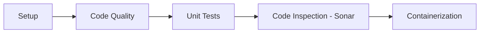

# 🧩 CloudFlow — Pipeline CI/CD Azure DevOps (Spring Boot / Maven)

## 1) Introduction

**CloudFlow** est un pipeline CI Azure DevOps **modulaire, templaté** et **réutilisable** pour des projets **Java Spring Boot (Maven)**. Il orchestre un dépôt applicatif (ex. GitHub) via `resources.repositories`, puis exécute une chaîne complète de contrôles **qualité**, **tests**, **sécurité (DevSecOps)** et **conteneurisation Docker**.

### Capacités couvertes

- **Toolchain & cache** : installation JDK, cache Maven
- **Qualité code** : Spotless *(optionnel)*, Checkstyle
- **Tests** : tests unitaires + rapports JUnit, couverture JaCoCo (artefact)
- **Inspection** : analyse SonarCloud/SonarQube via Maven + **Quality Gate bloquant**
- **DevSecOps** : Trivy SAST (vulnérabilités / secrets / misconfig) + publication SARIF
- **Containerisation** : Docker Buildx + BuildKit + **remote caching** + push registry

> Le pipeline orchestrateur est défini dans `ci-azure-pipelines.yml` et s’appuie sur les templates présents dans `templates/`.

---

## 2) Pré-requis du projet client

### 2.1 Structure minimum attendue (projet applicatif)

```text
projet/
├── pom.xml
├── mvnw
├── mvnw.cmd
├── Dockerfile
└── src/
    ├── main/java/
    ├── main/resources/
    └── test/java/
```

### 2.2 Exigences techniques

| Élément |        Requis | Détails |
|---|--------------:|---|
| Java |           21+ | Le pipeline est configuré avec une version fixée (`DETECTED_JDK=21` par défaut). |
| Maven |   via Wrapper | Le pipeline privilégie `./mvnw`. (Sinon fallback `mvn` côté agent.) |
| Dockerfile |               | Un `Dockerfile` doit être disponible dans le répertoire de travail (`workingDir`). |
| Spring Boot |               | Compatible Spring Boot 3.x. |

### 2.3 Plugins Maven recommandés / attendus

| Plugin | Statut | Pourquoi |
|---|---|---|
| `jacoco-maven-plugin` | requis | Couverture pour Azure DevOps + Sonar (rapport `jacoco.xml`). |
| `maven-checkstyle-plugin` | requis | Règles de style / standards Google. |
| `sonar-maven-plugin` | requis | Analyse Sonar via Maven Wrapper. |
| `spotless-maven-plugin` | optionnel | Si présent, le pipeline applique `spotless:check` (sinon étape ignorée). |

---

## 3) Configuration Azure DevOps

### 3.1 Variable Group : `cloudflow-global-config`

Créez un variable group **Azure DevOps Library** nommé : **`cloudflow-global-config`**.

> **Règle d’or** : marquez en **Secret** toutes les variables sensibles (tokens / passwords).

| Variable | Type | Exemple / Attendu | Description |
|---|---|---|---|
| `CLOUD_PROVIDER` | Variable | `AZURE` | Routage du stage de containerisation (`AZURE` par défaut). |
| `GITHUB_TOKEN` | **Secret** | `ghp_***` | Token GitHub pour réduire le rate limiting (Trivy / downloads). |
| `REGISTRY_SERVER_URL` | Variable | `monacr.azurecr.io` | URL du registry (ACR). |
| `REGISTRY_REPO_NAME` | Variable | `mon-projet/backend` | Nom du repository dans le registry. |
| `REGISTRY_USERNAME` | Variable | `xxxxx` | Username registry (ACR). |
| `REGISTRY_PASSWORD` | **Secret** | `***` | Password registry (ACR). |
| `SECRET_TOKEN` | **Secret** | `***` | Secret injecté au build Docker (`--secret id=TOKEN`). |
| `SONAR_HOST_URL` | Variable | `https://sonarcloud.io` | URL SonarCloud/SonarQube. |
| `SONAR_ORG` | Variable | `my-org` | Organisation SonarCloud. |
| `SONAR_PROJECT_KEY` | Variable | `my-project-key` | Clé projet Sonar. |
| `SONAR_TOKEN` | **Secret** | `***` | Token Sonar (auth + quality gate). |

> Le pipeline inclut déjà `- group: cloudflow-global-config` dans `ci-azure-pipelines.yml`.

### 3.2 Connexions de service (Service Connections)

| Connexion |        Requis | Pourquoi |
|---|--------------:|---|
| GitHub (endpoint) |               | Le pipeline consomme un repo externe via `resources.repositories` (ex: `endpoint: Jermielkoune-github-connexion-auth`). |
| Azure Container Registry |  recommandé | Possible selon votre politique : ici, le template Azure utilise `docker login` avec user/password. Une service connection reste une bonne pratique. |

---

## 4) Architecture du pipeline

Le pipeline est structuré en **5 stages séquentiels** (plus un routage cloud en fin de chaîne).

### 4.1 Diagramme (Mermaid)



### 4.2 Détail des stages

| Stage | Rôle | Templates / tâches clés | Sorties |
|---|---|---|---|
| **1. Setup** | Préparation toolchain | `templates/toolchain.yml` (Cache Maven + JDK + audit `mvnw`) | Variable `MAVEN_OPTS` + environnement prêt |
| **2. Code_Quality** | Lint & sécurité SAST | `templates/quality-check.yml` + `templates/security-sast.yml` | Rapport SARIF Trivy (artefact) |
| **3. Unit_Tests** | Tests + JaCoCo | `templates/test-unit.yml` + `templates/test-integration-h2.yml` | Artefact `jacoco-ut` |
| **4. Code_Inspection** | Sonar + Quality Gate | `templates/sonar-scan.yml` + download `jacoco-ut` | Échec si Quality Gate KO |
| **5. Containerization** | Build/push image + scan image | `templates/docker-build-to-azure.yml` → `docker-build-and-push.yml` | Image poussée + scan Trivy image |

### 4.3 Outils utilisés

| Domaine | Outil | Usage |
|---|---|---|
| SAST / secrets / misconfig | **Trivy** | Scan filesystem (`trivy fs`) + publication SARIF (`CodeAnalysisLogs`). |
| Qualité / dette technique | **SonarCloud/SonarQube** | Analyse via Maven (`sonar:sonar`) + `sonar.qualitygate.wait=true`. |
| Containerisation | **Docker Buildx / BuildKit** | Build multi-plateforme + `--cache-from/--cache-to` (remote caching). |
| Registry Azure | **ACR** | Push image via Docker CLI (`docker login`, `buildx build --push`). |

---

## 5) Déclenchement du pipeline

Le pipeline orchestrateur ne se déclenche pas sur son propre dépôt :

- `trigger: none`
- `pr: none`

Le déclenchement provient du dépôt applicatif déclaré dans :

- `resources.repositories` (ex: repo `Sikaseal` sur GitHub)
- filtres de branches et chemins (`src/`, `pom.xml`, etc.)

---

## 6) Containerization : Azure (stable) vs AWS (à venir)

### 6.1 Azure ACR (stable)

Le routage par défaut utilise :

- `templates/docker-build-to-azure.yml`
- qui appelle `templates/docker-build-and-push.yml`

Variables nécessaires :

- `REGISTRY_SERVER_URL`
- `REGISTRY_REPO_NAME`
- `REGISTRY_USERNAME`
- `REGISTRY_PASSWORD`
- `SECRET_TOKEN` *(si utilisé par votre Dockerfile)*

### 6.2 AWS ECR (en cours de refonte 🛠️ — À venir)

Le routage `CLOUD_PROVIDER=AWS` existe déjà dans `ci-azure-pipelines.yml`, mais l’implémentation actuelle basée sur **AWS CLI + token** est en cours de refonte.

**Objectif de la refonte** : utiliser les tâches natives / extension **AWS Toolkit for Azure DevOps**, notamment **`ECRPush`**, via une **AWS Service Connection**, afin de :

- fiabiliser l’authentification (éviter les `401 Unauthorized` / tokens éphémères)
- standardiser le push ECR
- éviter la gestion manuelle des credentials dans des scripts

> Statut : **À venir** (work in progress). La version stable actuelle cible Azure ACR.

---

## 7) Sécurité, Fail-Fast & artefacts

### 7.1 Politique Fail-Fast (bloquante)

| Contrôle | Comportement |
|---|---|
| Trivy SAST (`templates/security-sast.yml`) | Échec du job si vulnérabilités / findings **CRITICAL,HIGH** (exit code 1). |
| Sonar (`templates/sonar-scan.yml`) | Échec si le **Quality Gate** ne passe pas (`sonar.qualitygate.wait=true`). |
| Checkstyle | Échec si violations de règles. |
| Spotless | Échec **uniquement si le plugin est présent** (sinon étape ignorée). |

### 7.2 Artefacts publiés

| Artefact | Produit par | Contenu |
|---|---|---|
| `jacoco-ut` | `templates/test-unit.yml` | Rapports `**/target/site/jacoco/jacoco.xml` (multi-modules support). |
| `CodeAnalysisLogs` | `templates/security-sast.yml` | `trivy-report.sarif` (importable dans des outils SARIF). |

---

## 8) Templates principaux (référence)

| Template | Rôle |
|---|---|
| `templates/toolchain.yml` | Cache Maven + JDK + audit wrapper |
| `templates/quality-check.yml` | Spotless (optionnel) + Checkstyle |
| `templates/security-sast.yml` | Trivy `fs` + SARIF + quality gate sur sévérité |
| `templates/test-unit.yml` | Tests unitaires + JaCoCo + artefact |
| `templates/test-integration-h2.yml` | Tests d’intégration (profil `test`, H2) |
| `templates/sonar-scan.yml` | Scan Sonar + attente du Quality Gate |
| `templates/docker-build-to-azure.yml` | Wrapper Azure vers build/push |
| `templates/docker-build-and-push.yml` | Login + Buildx remote cache + scan image Trivy |

---

### Annexes

- 📄 Pipeline orchestrateur : `ci-azure-pipelines.yml`
- 📁 Templates : `templates/`

