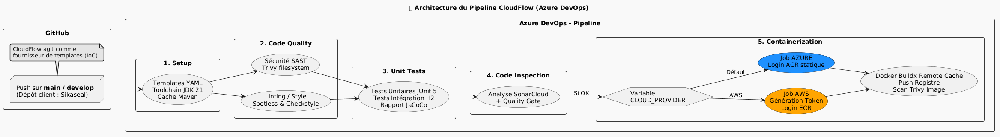

# CloudFlow — Pipeline CI/CD Azure DevOps (Spring Boot / Maven)

## Sommaire
- [1. Introduction et Principes d'Architecture](#1-introduction-et-principes-darchitecture)
- [2. Déclenchement du Pipeline](#2-déclenchement-du-pipeline)
- [3. Pré-requis et Informations Projet Client](#3-pré-requis-et-informations-projet-client)
- [4. Configuration Azure DevOps](#4-configuration-azure-devops)
- [5. Architecture du Pipeline (Stages & Outils)](#5-architecture-du-pipeline-stages--outils)
- [6. Containerisation : Push sur Cloud Provider](#6-containerisation--push-sur-cloud-provider)
- [7. Sécurité, Fail-Fast & Artefacts](#7-sécurité-fail-fast--artefacts)
- [8. Templates Principaux (Référence)](#8-templates-principaux-référence)

---

## 1. Introduction et Principes d'Architecture

**CloudFlow** est un pipeline CI Azure DevOps modulaire, templaté et réutilisable pour des projets **Java Spring Boot (Maven)**. Il orchestre un dépôt applicatif via `resources.repositories`, puis exécute une chaîne complète de contrôles : qualité, tests, sécurité (DevSecOps) et conteneurisation Docker.

### 1.1 Architecture (3 Acteurs)
Le système repose sur la collaboration de trois entités :
1. **Le dépôt CloudFlow (GitHub)** : Contient le pipeline orchestrateur `ci-azure-pipelines.yml` et les templates YAML associés.
2. **Le dépôt Client (ex. Sikaseal sur GitHub)** : Le projet applicatif à construire et à tester.
3. **Azure DevOps (Pipelines)** : Héberge la définition logique du pipeline (pointant vers le YAML CI/CD sur GitHub) et exécute les jobs sur des agents Azure.

### 1.2 Principes d'Ingénierie
- **Agnosticisme Cloud** : Le pipeline est agnostique par rapport au fournisseur cloud. L'architecture met en pratique l'**Inversion de Contrôle (IoC)** et le **Pattern Façade** pour éviter tout couplage fort avec l'infrastructure.
- **Build Docker Optimisé** : Le pipeline utilise le plugin performant **Buildx** couplé à BuildKit pour gérer nativement la mise en cache distante (remote caching) et l'optimisation des couches Docker.

---

## 2. Déclenchement du Pipeline

Conformément à l'inversion de contrôle, le dépôt CloudFlow agit uniquement en tant que fournisseur de logique applicative :
- Un `push` ou une *Pull Request* sur le dépôt **CloudFlow** ne déclenche aucune exécution du pipeline.
- Un `push` sur les branches principales (`main` ou `develop`) dans le dépôt du projet client (**Sikaseal**) déclenche automatiquement l'exécution sur Azure DevOps.

---

## 3. Pré-requis et Informations Projet Client

### 3.1 Règles de Développement (Projet Sikaseal et autres)
1. **Contrôle Qualité Local** : Il est recommandé de lancer cette ligne de commande avant tout commit pour garantir le respect des normes en vigueur (une non-conformité bloquera la CI) :
   ```bash
   ./mvnw spotless:apply checkstyle:check
   ```
2. **Gestion de la Version Java** : Le pipeline détecte **automatiquement** la version de Java depuis le fichier `pom.xml`. Pour éviter des builds incohérents, le projet doit définir explicitement cette version via les balises `<maven.compiler.release>` ou `<java.version>`. Si rien n'est spécifié, CloudFlow appliquera le JDK 21 par défaut.
3. **Vulnérabilités SAST** : Le scanner **Trivy** analyse le code et l'image projet. Les développeurs doivent rester vigilants concernant les dépendances Maven intégrées et les faire évoluer en cas de correctif de sécurité requis.

### 3.2 Structure Minimum Attendue
```text
projet/
├── pom.xml
├── mvnw
├── mvnw.cmd
├── Dockerfile
└── src/
    ├── main/java/
    ├── main/resources/
    └── test/java/
```

### 3.3 Exigences Techniques et Plugins Maven
- **Java** : Version 21+ (`DETECTED_JDK=21` initialisé par défaut).
- **Maven** : Wrapper Maven exigé (`./mvnw`).
- **Spring Boot** : Compatible et recommandé à partir de la version 4.x.
- **Dockerfile** : Attendu à la racine du projet (`workingDir`).

**Plugins Maven nécessaires / attendus :**

| Rôle | Plugin | Statut |
|---|---|---|
| **Format** | Spotless | **Bloquant** |
| **Lint/Style** | Checkstyle | **Bloquant** |
| **Build** | Compiler Plugin | Requis |
| **Tests** | Surefire | Requis |
| **Coverage + Rapport** | JaCoCo | Requis |
| **Artefact Exécutable** | Spring Boot Maven Plugin | Requis (Launcher) |

---

## 4. Configuration Azure DevOps

### 4.1 Variable Group : `cloudflow-global-config`
Créez un Variable Group (Library) Azure DevOps nommé par exemple `cloudflow-global-config`.

> **Important** : Les variables sensibles (jetons d'accès, mots de passe) doivent impérativement être configurées en tant que **Secret**.

| Variable | Type | Exemple | Description |
|---|---|---|---|
| `CLOUD_PROVIDER` | Variable | `AZURE` | Routage du stage de containerisation (`AZURE` ou `AWS`). |
| `GITHUB_TOKEN` | **Secret** | `ghp_***` | Token GitHub pour réduire le rate limiting (téléchargements Trivy). |
| `REGISTRY_SERVER_URL` | Variable | `monacr.azurecr.io` | URL d'accès complet au registre (ACR/ECR). |
| `REGISTRY_REPO_NAME` | Variable | `projet/backend` | Nom ciblé du dépôt applicatif dans le registre. |
| `REGISTRY_USERNAME` | Variable | `user123` | Nom d'utilisateur valide pour s'y connecter. |
| `REGISTRY_PASSWORD` | **Secret** | `***` | Mot de passe de connexion associé. |
| `SECRET_TOKEN` | **Secret** | `***` | Secret optionnel injecté au build Docker (`--secret id=TOKEN`). |
| `SONAR_HOST_URL` | Variable | `https://sonarcloud.io` | Instance cible SonarQube/SonarCloud. |
| `SONAR_ORG` | Variable | `my-org` | Nom de l'organisation SonarCloud du projet. |
| `SONAR_PROJECT_KEY` | Variable | `my-project` | Clé désignant le projet Sonar applicatif. |
| `SONAR_TOKEN` | **Secret** | `***` | Jeton d'authentification pour Sonar. |

### 4.2 Connexions de Service (Service Connections)
- **GitHub (Endpoint)** : Requis. Le pipeline Azure DevOps doit pouvoir extraire le code du dépôt externe via l'instruction `resources.repositories` (ex: `endpoint: Jermielkoune-github-connexion-auth`).

---

## 5. Architecture du Pipeline (Stages & Outils)

Le flux de la logique d'intégration et de déploiement continus est structuré hiérarchiquement en 5 stages :



| Stage | Rôle | Artefacts / Résultats |
|---|---|---|
| **1. Setup** | Cache Maven, configuration JDK, audit `mvnw`. | Environnement applicatif instancié. |
| **2. Code_Quality** | Lints (Spotless, Checkstyle) et SAST Trivy. | Exécution des contrôles, fichier SARIF exporté. |
| **3. Unit_Tests** | Lancement des tests. Collecte analytique JaCoCo. | Artefact de build `jacoco-ut`. |
| **4. Code_Inspection** | Audit SonarCloud, Quality Gate (Validation Metrics). | Synthèse de supervision du projet passée. |
| **5. Containerization** | Application Buildx, image push et scan des vulnérabilités de l'image. | Image Docker hébergée en toute sécurité. |

**Outils Utilisés :**

| Domaine | Outil | Usage |
|---|---|---|
| SAST / secrets / misconfig | **Trivy** | Scan filesystem (`trivy fs`) + publication SARIF (`CodeAnalysisLogs`). |
| Qualité / dette technique | **SonarCloud/SonarQube** | Analyse via Maven (`sonar:sonar`) + `sonar.qualitygate.wait=true`. |
| Containerisation | **Docker Buildx / BuildKit** | Build multi-plateforme + `--cache-from/--cache-to` (remote caching). |
| Registry Azure | **ACR** | Push image via Docker CLI (`docker login`, `buildx build --push`). |

---

## 6. Containerisation : Push sur Cloud Provider

La méthodologie de build CloudFlow est **entièrement agnostique**. Par l'intermédiaire du *Pattern Façade*, toute l'intelligence de la construction (BuildKit, cache distant, paramètres CI) demeure centralisée dans un unique template : `docker-build-and-push.yml`.

L'aiguillage est effectué via la variable globale `CLOUD_PROVIDER` :

**Variables communes impératives :**
- `registryServer: '$(REGISTRY_SERVER_URL)'` : Adresse du registre.
- `registryUsername: '$(REGISTRY_USERNAME)'` : Utilisateur de connexion.
- `registryPassword: '$(REGISTRY_PASSWORD)'` : Mot de passe de connexion (statique).
- `repository: '$(REGISTRY_REPO_NAME)'` : Nom complet du répertoire conteneurisé voulu.

### 6.1 Azure ACR (`CLOUD_PROVIDER=AZURE` ou par défaut)
Le flux technique s'oriente vers la façade `docker-build-to-azure.yml`.
Il exploite directement les identifiants statiques mis à sa disposition par le *Variable Group* préconfiguré, avant de déléguer la main au build.

### 6.2 AWS ECR (`CLOUD_PROVIDER=AWS`)
Le flux s'oriente vers la façade `docker-build-to-aws.yml`.
Il gère une authentification éphémère et dynamique à l'aide de l'**AWS CLI** :
1. Audit du compte IAM par requête (`aws sts get-caller-identity`).
2. Vérification complète des accès au dépôt applicatif cloud ciblé.
3. Échanges, création du jeton de session temporaire et délégation d'authentification au template fédérateur.

**Variables AWS additionnelles (Via environnement Azure DevOps) :**
- `AWS_ACCESS_KEY_ID` : L'identifiant de la clé d'accès associé à un Utilisateur IAM.
- `AWS_SECRET_ACCESS_KEY` : La clé secrète attenante (**Secret**).
- `AWS_REGION` : La région AWS (ex: `us-east-1`).

---

## 7. Sécurité, Fail-Fast & Artefacts

### 7.1 Normes Bloquantes (Fail-Fast)
Afin de prévenir toute déploiement endommagé, CloudFlow interrompra automatiquement le Build dans les contextes suivants :
- **Checkstyle** : Existence attestée d'une mauvaise pratique de style (`violations`).
- **Spotless** : Mauvais formatage (si le plugin est identifié dans le projet client).
- **Trivy SAST / Image** : Révélation d'au moins une vulnérabilité reconnue comme de criticité **CRITICAL** ou **HIGH** (Rend un exit-code 1).
- **SonarQube** : Le *Quality Gate* du projet n'est pas franchi et échoue (`sonar.qualitygate.wait=true`).

### 7.2 Post-Traitement des Artefacts
- **SARIF** : Création autonome de l'historique d'analyse statique du code `trivy-report.sarif`, destiné aux agrégateurs DevSecOps d'Azure DevOps.
- **JaCoCo** : Agrégation et mise à disposition des rapports XML multi-modules standardisés (`**/target/site/jacoco/jacoco.xml`).

---

## 8. Templates Principaux (Référence)

| Template Modulaire | Objectif |
|---|---|
| `toolchain.yml` | Paramètres fondamentaux environnementaux (Cache `.m2`, JDK). |
| `quality-check.yml` | Contrôles drastiques (Spotless et Checkstyle). |
| `security-sast.yml` | Détection exhaustive du file-system (Trivy) et exports log SARIF. |
| `test-unit.yml` | Exécution des TU et collecte algorithmique de couverture de code (JaCoCo). |
| `test-integration-h2.yml` | Exécution des tests de la configuration d'intégration par profil en DB embarquée (H2). |
| `sonar-scan.yml` | Transferts des calculs vers SonarQube et écoute du comportement Quality Gate. |
| `docker-build-to-azure.yml`| Façade vers les méthodes de conteneurisation Azure ACR. |
| `docker-build-to-aws.yml` | Façade de connexion et gestion des identités IAM vers AWS ECR. |
| `docker-build-and-push.yml`| Moteur central Buildx (Push, Cache ECR/ACR, Trivy Image Scanner). |
