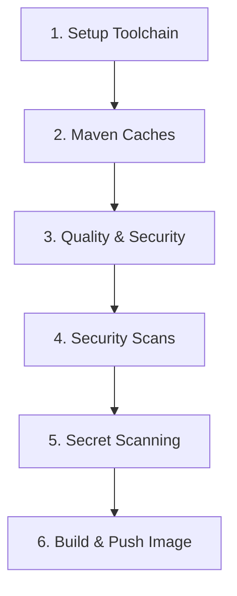

# Pipeline CI/CD Azure DevOps - Spring Boot Backend

## 📋 Introduction

Ce pipeline CI/CD Azure DevOps modulaire et réutilisable automatise l'intégration continue et le déploiement continu pour des projets **Java Spring Boot (Maven)**.

### Objectifs du Pipeline

- ✅ **Qualité du code** : Tests unitaires, analyse SonarCloud avec Quality Gate
- ✅ **Sécurité** : SAST (OWASP Dependency-Check), DAST (OWASP ZAP), scan de secrets (Gitleaks)
- ✅ **Déploiement** : Build et push d'images Docker vers AWS ECR via Jib
- ✅ **Performance** : Mise en cache Maven pour des builds rapides
- ✅ **Flexibilité** : Architecture basée sur des templates réutilisables

---

## 🔧 Pré-requis du Projet Java

Votre projet doit respecter les exigences suivantes :

### Structure du Projet

```
backend/
├── pom.xml                    # Maven POM (obligatoire)
├── mvnw                       # Maven Wrapper (obligatoire, exécutable)
├── mvnw.cmd                   # Maven Wrapper Windows
├── src/
│   ├── main/java/             # Sources Java
│   ├── main/resources/        # Ressources (application.properties, etc.)
│   └── test/java/             # Tests unitaires
├── sonar-project.properties   # Configuration SonarCloud (optionnel)
└── .gitleaks.toml            # Configuration Gitleaks (optionnel)
```

### Exigences Techniques

| Composant | Version | Commentaire |
|-----------|---------|-------------|
| **Java** | 17+ | Version par défaut, configurable via `JDK_VERSION` |
| **Maven** | 3.6+ | Via Maven Wrapper (`mvnw`) |
| **Spring Boot** | 2.x ou 3.x | Profil `prod` recommandé pour le build |
| **Docker** | — | Non requis localement (Jib utilisé) |

### Plugins Maven Requis

Votre `pom.xml` doit inclure :

```xml
<plugin>
    <groupId>org.jacoco</groupId>
    <artifactId>jacoco-maven-plugin</artifactId>
    <!-- Pour la couverture de code SonarCloud -->
</plugin>

<plugin>
    <groupId>org.owasp</groupId>
    <artifactId>dependency-check-maven</artifactId>
    <!-- Pour l'analyse de sécurité des dépendances -->
</plugin>

<plugin>
    <groupId>com.google.cloud.tools</groupId>
    <artifactId>jib-maven-plugin</artifactId>
    <!-- Pour la création d'images Docker sans Docker daemon -->
</plugin>
```

---

## 🏗️ Architecture du Pipeline

Le pipeline est organisé en **6 stages séquentiels** :



### Détail des Stages

| Stage | Description | Outils | Durée estimée |
|-------|-------------|--------|---------------|
| **1. Setup Toolchain** | Installation JDK et vérification Maven Wrapper | JavaToolInstaller | ~30s |
| **2. Maven Caches** | Restauration des caches Maven + `dependency:go-offline` | Cache@2 | ~1-3min |
| **3. Quality & Security** | Tests unitaires + Analyse SonarCloud avec Quality Gate | Maven, SonarCloud | ~3-10min |
| **4. Security Scans** | SAST (Dependency-Check) + DAST optionnel (ZAP) | OWASP DC, ZAP | ~5-15min |
| **5. Secret Scanning** | Détection de secrets/tokens dans le code | Gitleaks | ~30s |
| **6. Build & Push Image** | Compilation production + Push vers AWS ECR | Jib, AWS ECR | ~2-5min |

### Flux des Jobs

```
Stage 1: setup_toolchain
  └─ pin_java (Install JDK 17)

Stage 2: deps_cache
  └─ cache_and_prime (Restore Maven cache + go-offline)

Stage 3: quality_security
  ├─ unit_tests (Maven test + JUnit reports)
  └─ sonarcloud_analysis (depends: unit_tests)
       └─ Quality Gate verification (bloque si KO sur main)

Stage 4: security_scans
  ├─ sast_depcheck_docker (OWASP Dependency-Check)
  └─ dast_zap (OWASP ZAP, uniquement sur main)

Stage 5: secret_scan
  └─ gitleaks (Scan de secrets, bloque sur main si détection)

Stage 6: build_and_push_image
  └─ jib_to_ecr (Build Jib + Multi-tagging ECR)
```

---

## ⚙️ Configuration des Variables

### Variables à Surcharger

Toutes les variables sont définies dans `azure/templates/variables-common.yml` et peuvent être surchargées dans votre `azure-pipelines.yml`.

#### 🔹 Variables Obligatoires (via Variable Group Azure DevOps)

Créez un **Variable Group** nommé `cloudflow` (ou personnalisez `variableGroupName`) contenant :

| Variable | Type | Description | Exemple |
|----------|------|-------------|---------|
| `SONAR_TOKEN` | Secret | Token d'authentification SonarCloud | `sqp_abc123...` |
| `NVD_API_KEY` | Secret | Clé API NVD pour Dependency-Check (optionnel mais recommandé) | `abc-def-123...` |

#### 🔹 Variables de Configuration (Paramètres Template)

| Catégorie | Variable | Type | Défaut | Description |
|-----------|----------|------|--------|-------------|
| **Toolchain** | `JDK_VERSION` | string | `'17'` | Version Java à installer |
| **Agent** | `vmImage` | string | `'ubuntu-latest'` | Type d'agent Azure (ubuntu/windows) |
| **AWS/ECR** | `AWS_REGION` | string | `'eu-west-3'` | Région AWS pour ECR |
| | `ECR_REPOSITORY` | string | `'sikaseal/cloudflow-ecr'` | Nom du repository ECR |
| | `AWS_SERVICE_CONNECTION` | string | `'aws-cloudflow-sc'` | Service Connection Azure DevOps vers AWS |
| **SonarCloud** | `SONAR_HOST_URL` | string | `'https://sonarcloud.io'` | URL SonarCloud |
| | `SONAR_ORG` | string | `'sikaseal'` | Organisation SonarCloud |
| | `SONAR_PROJECT_KEY` | string | `'sikaseal_cloudflow'` | Clé du projet SonarCloud |
| | `QUALITY_GATE_BLOCK_POLICY` | string | `'main'` | Branches où bloquer si QG KO (`main`, `main+develop`, `none`) |
| **Dependency-Check** | `DEPCHK_VERSION` | string | `'12.1.1'` | Version du plugin Maven |
| | `DEPCHK_FORMATS` | string | `'JSON'` | Formats de rapport (`JSON`, `HTML`, `SARIF`) |
| | `DEPCHK_FAIL_CVSS` | string | `'7.0'` | Seuil CVSS pour échouer le build |
| | `DEPCHK_CONTINUE_ON_NON_MAIN` | string | `'true'` | Continuer sur erreur hors main |
| **DAST (ZAP)** | `RUN_DAST_ON_MAIN` | string | `'true'` | Activer DAST sur main |
| | `DAST_TARGET_URL` | string | `'http://localhost:8080'` | URL cible pour le scan ZAP |
| **Gitleaks** | `GITLEAKS_VERSION` | string | `'8.18.1'` | Version de Gitleaks |

---

## 🚀 Comment Utiliser ce Pipeline

### Étape 1 : Préparer votre Projet

1. **Vérifiez les pré-requis** (Java 17, Maven Wrapper, structure du projet)
2. **Créez le Variable Group** dans Azure DevOps :
   - Allez dans **Pipelines > Library > Variable groups**
   - Créez un groupe nommé `cloudflow`
   - Ajoutez `SONAR_TOKEN` et `NVD_API_KEY` (en tant que secrets)

### Étape 2 : Créer le Service Connection AWS

Si vous déployez vers AWS ECR :

1. Allez dans **Project Settings > Service connections**
2. Créez une connexion AWS nommée `aws-cloudflow-sc`
3. Configurez vos credentials AWS (Access Key ID + Secret)

### Étape 3 : Créer votre Pipeline

Créez un fichier `azure-pipelines.yml` à la racine de votre projet backend :

```yaml
# azure-pipelines.yml
# Pipeline orchestrateur CI Backend - Version templateisée

# -----------------------------------------------------------------------------
# Variables globales
# -----------------------------------------------------------------------------
variables:
  - template: azure/templates/variables-common.yml
    parameters:
      variableGroupName: 'cloudflow'  # Nom de votre Variable Group
      
      # Toolchain
      JDK_VERSION: '17'
      
      # Type d'agent
      vmImage: 'ubuntu-latest'
      
      # AWS / ECR
      AWS_REGION: 'eu-west-3'
      ECR_REPOSITORY: 'votre-org/votre-repo'
      AWS_SERVICE_CONNECTION: 'aws-cloudflow-sc'
      
      # SonarCloud
      SONAR_HOST_URL: 'https://sonarcloud.io'
      SONAR_ORG: 'votre-org'
      SONAR_PROJECT_KEY: 'votre-org_votre-projet'
      
      # Dependency-Check
      DEPCHK_VERSION: '12.1.1'
      DEPCHK_FORMATS: 'JSON'
      DEPCHK_FAIL_CVSS: '7.0'
      DEPCHK_CONTINUE_ON_NON_MAIN: 'true'
      
      # DAST (ZAP)
      RUN_DAST_ON_MAIN: 'true'
      DAST_TARGET_URL: 'http://localhost:8080'
      
      # Gitleaks
      GITLEAKS_VERSION: '8.18.1'
      
      # Quality Gate policy
      QUALITY_GATE_BLOCK_POLICY: 'main'

# -----------------------------------------------------------------------------
# Déclencheurs
# -----------------------------------------------------------------------------
trigger:
  batch: true
  branches:
    include: [ main, develop ]
  paths:
    include: ['backend/pom.xml', 'backend/src/**']
    exclude: ['docs/**', 'README.md', '.github/**', '**/*.md']

# PR (GitHub): build de validation
pr:
  autoCancel: true
  drafts: false
  branches:
    include: [main, develop]
  paths:
    include: ['backend/pom.xml', 'backend/src/**']
    exclude: ['docs/**', 'README.md', '.github/**', '**/*.md']

# -----------------------------------------------------------------------------
# Pool
# -----------------------------------------------------------------------------
pool:
  vmImage: '$(vmImage)'

# -----------------------------------------------------------------------------
# Stages
# -----------------------------------------------------------------------------
stages:
  # Stage 1 – Toolchain Java
  - stage: setup_toolchain
    displayName: 'Setup toolchain'
    jobs:
      - job: pin_java
        displayName: 'Install JDK & verify Maven wrapper'
        steps:
          - checkout: self
          - template: azure/templates/toolchain.yml
            parameters:
              jdkVersion: '$(JDK_VERSION)'
              backendDir: '$(BACKEND_DIR)'

  # Stage 2 – Caches Maven
  - stage: deps_cache
    displayName: 'Maven caches + go-offline'
    dependsOn: setup_toolchain
    jobs:
      - job: cache_and_prime
        displayName: 'Restore Maven caches'
        steps:
          - checkout: self
          - template: azure/templates/maven-cache.yml
            parameters:
              backendDir: '$(BACKEND_DIR)'
              cacheKeysStrategy: 'pom-hash'
          - script: ./mvnw -B dependency:go-offline -DskipTests
            displayName: 'Prime Maven dependencies'
            workingDirectory: '$(BACKEND_DIR)'

  # Stage 3 – Qualité & Sécurité
  - stage: quality_security
    displayName: 'Quality gates + Security'
    dependsOn: deps_cache
    jobs:
      - job: unit_tests
        displayName: 'Run unit tests'
        steps:
          - checkout: self
          - template: azure/templates/tests-unitaires.yml
            parameters:
              backendDir: '$(BACKEND_DIR)'
              mvnArgs: '-B -ntp'
              testResultsGlob: '$(BACKEND_DIR)/target/surefire-reports/*.xml'

      - job: sonarcloud_analysis
        displayName: 'SonarCloud analysis'
        dependsOn: unit_tests
        condition: succeeded()
        steps:
          - checkout: self
          - template: azure/templates/sonarcloud.yml
            parameters:
              backendDir: '$(BACKEND_DIR)'
              sonarHostUrl: '$(SONAR_HOST_URL)'
              sonarOrg: '$(SONAR_ORG)'
              projectKey: '$(SONAR_PROJECT_KEY)'
              tokenVarName: 'SONAR_TOKEN'
              blockOnQualityGate: 'true'
              blockOnBranches: '$(QUALITY_GATE_BLOCK_POLICY)'
              jacocoXmlPath: 'target/site/jacoco/jacoco.xml'
              junitReportPath: 'target/surefire-reports'

  # Stage 4 – Security Scans
  - stage: security_scans
    displayName: 'Security scans (SAST & DAST)'
    dependsOn: quality_security
    condition: succeeded()
    jobs:
      - job: sast_depcheck
        displayName: 'SAST — OWASP Dependency-Check'
        steps:
          - checkout: self
          - template: azure/templates/sast-depcheck.yml
            parameters:
              backendDir: '$(BACKEND_DIR)'
              depcheckVersion: '$(DEPCHK_VERSION)'
              formats: '$(DEPCHK_FORMATS)'
              failCvss: '$(DEPCHK_FAIL_CVSS)'
              dataDir: '$(DEPCHK_DATA_DIR)'
              suppressionPath: ''
              nvdApiKeyVarName: 'NVD_API_KEY'
              autoupdateOnMain: 'true'
              continueOnNonMain: 'true'
              publishArtifacts: 'true'

      - job: dast_zap
        displayName: 'DAST — OWASP ZAP'
        condition: and(succeeded(), eq(variables['RUN_DAST_ON_MAIN'], 'true'), eq(variables['Build.SourceBranch'], 'refs/heads/main'))
        steps:
          - checkout: self
          - template: azure/templates/dast-zap.yml
            parameters:
              backendDir: '$(BACKEND_DIR)'
              targetUrl: '$(DAST_TARGET_URL)'
              runOnBranches: [main]
              startupProfile: 'e2e'
              startupWaitSeconds: '60'
              publishArtifacts: 'true'

  # Stage 5 – Secret Scanning
  - stage: secret_scan
    displayName: 'Secret Scanning'
    dependsOn: security_scans
    condition: succeeded()
    jobs:
      - job: gitleaks
        displayName: 'Scan secrets with Gitleaks'
        steps:
          - checkout: self
            fetchDepth: 1
          - template: azure/templates/secret-scan-gitleaks.yml
            parameters:
              gitleaksVersion: '$(GITLEAKS_VERSION)'
              jsonReportName: '$(GITLEAKS_REPORT_JSON)'
              sarifReportName: '$(GITLEAKS_REPORT_SARIF)'
              blockOnMainWhenLeaks: 'true'
              useConfigFile: 'true'

  # Stage 6 – Build & Push Image
  - stage: build_and_push_image
    displayName: 'Build & Push to ECR'
    dependsOn: secret_scan
    condition: succeeded()
    jobs:
      - job: jib_to_ecr
        displayName: 'Jib build & push'
        steps:
          - checkout: self
          - template: azure/templates/jib-ecr.yml
            parameters:
              backendDir: '$(BACKEND_DIR)'
              awsServiceConnection: '$(AWS_SERVICE_CONNECTION)'
              awsRegion: '$(AWS_REGION)'
              ecrRepository: '$(ECR_REPOSITORY)'
              tagBranchPatterns:
                main: 'main-latest'
              publishJarArtifact: 'true'
```

### Étape 4 : Commit & Push

```bash
git add azure-pipelines.yml azure/templates/
git commit -m "feat: Add CI/CD pipeline"
git push origin main
```

### Étape 5 : Créer le Pipeline dans Azure DevOps

1. Allez dans **Pipelines > New pipeline**
2. Sélectionnez votre repository
3. Choisissez **Existing Azure Pipelines YAML file**
4. Sélectionnez `azure-pipelines.yml`
5. **Run** le pipeline

---

## 🔐 Bonnes Pratiques de Sécurité

### Gestion des Secrets

✅ **À FAIRE :**
- Stocker tous les secrets dans un **Variable Group** Azure DevOps
- Marquer les variables comme **Secret** (masquées dans les logs)
- Utiliser des **Service Connections** pour les credentials cloud (AWS, Azure)
- Restreindre l'accès au Variable Group aux équipes autorisées

❌ **À NE PAS FAIRE :**
- Ne JAMAIS commiter de secrets dans le code
- Ne pas mettre de tokens en clair dans les fichiers YAML
- Ne pas logger les valeurs des secrets

### Quality Gates

Le pipeline bloque automatiquement sur `main` si :
- ❌ Le **Quality Gate SonarCloud** échoue (dette technique, bugs critiques, vulnérabilités)
- ❌ Des **CVE ≥ 7.0** sont détectées par Dependency-Check
- ❌ Des **secrets** sont détectés par Gitleaks

Sur les branches de développement (`develop`, feature branches) :
- ⚠️ Les erreurs sont signalées mais **ne bloquent pas** le build (configurable via `DEPCHK_CONTINUE_ON_NON_MAIN`)

---

## 📦 Templates Disponibles

| Template | Responsabilité | Paramètres clés |
|----------|----------------|-----------------|
| `toolchain.yml` | Installation JDK + vérification Maven | `jdkVersion`, `backendDir` |
| `maven-cache.yml` | Gestion des caches Maven (~/.m2) | `backendDir`, `cacheKeysStrategy` |
| `tests-unitaires.yml` | Exécution tests + publication rapports JUnit | `backendDir`, `mvnArgs`, `testResultsGlob` |
| `sonarcloud.yml` | Analyse code + Quality Gate | `sonarOrg`, `projectKey`, `blockOnQualityGate` |
| `sast-depcheck.yml` | SAST OWASP Dependency-Check + conversion SARIF | `depcheckVersion`, `failCvss`, `nvdApiKeyVarName` |
| `dast-zap.yml` | DAST OWASP ZAP (scan dynamique) | `targetUrl`, `startupProfile`, `runOnBranches` |
| `secret-scan-gitleaks.yml` | Détection secrets/tokens dans le code | `gitleaksVersion`, `blockOnMainWhenLeaks` |
| `jib-ecr.yml` | Build image Docker (Jib) + Push ECR multi-tags | `awsServiceConnection`, `ecrRepository`, `tagBranchPatterns` |
| `variables-common.yml` | Définition centralisée des variables | Tous les paramètres ci-dessus |

---

## 🐛 Troubleshooting

### Erreur : `Not found workingDirectory: /home/vsts/work/1/s/backend`

**Cause :** Le code source n'a pas été téléchargé (checkout manquant).

**Solution :** Ajoutez `- checkout: self` au début de chaque `job` qui a besoin du code :

```yaml
jobs:
  - job: mon_job
    steps:
      - checkout: self  # ← Ajouter cette ligne
      - template: azure/templates/mon-template.yml
```

### Erreur : `Quality Gate skipped due to condition evaluation`

**Cause :** Les variables ne sont pas correctement résolues dans la condition.

**Solution :** Vérifiez que le template `sonarcloud.yml` utilise `variables['QUALITY_GATE_BLOCK_POLICY']` et non `$(QUALITY_GATE_BLOCK_POLICY)` dans la condition.

### Erreur : `Failed to retrieve AWS Account ID`

**Cause :** Le Service Connection AWS n'est pas configuré ou a des permissions insuffisantes.

**Solution :**
1. Vérifiez que le Service Connection existe et est nommé correctement
2. Vérifiez que les credentials AWS ont les permissions `ecr:GetAuthorizationToken`, `ecr:PutImage`

### Les caches Maven ne sont pas réutilisés

**Cause :** La clé de cache change à chaque build.

**Solution :** Utilisez la stratégie `pom-hash` (par défaut) qui base la clé sur le contenu du `pom.xml` :

```yaml
cacheKeysStrategy: 'pom-hash'
```

---

## 📊 Optimisations de Performance

### Durée Totale du Pipeline

| Environnement | Première exécution | Exécutions suivantes (avec cache) |
|---------------|-------------------|-----------------------------------|
| **Petit projet** | ~15-20 min | ~8-12 min |
| **Projet moyen** | ~25-35 min | ~12-18 min |
| **Large projet** | ~40-60 min | ~20-30 min |

### Conseils d'Optimisation

1. **Caches Maven** : Réutilise automatiquement les dépendances entre builds
2. **Parallel Jobs** : Les jobs dans un même stage s'exécutent en parallèle quand possible
3. **DAST conditionnel** : ZAP ne s'exécute que sur `main` pour économiser du temps
4. **Shallow clone** : Gitleaks utilise `fetchDepth: 1` pour un clone rapide

---

## 📞 Support et Contribution

### Documentation Complémentaire

- [Azure Pipelines YAML Schema](https://learn.microsoft.com/en-us/azure/devops/pipelines/yaml-schema)
- [SonarCloud Documentation](https://docs.sonarcloud.io/)
- [OWASP Dependency-Check](https://owasp.org/www-project-dependency-check/)
- [Jib Maven Plugin](https://github.com/GoogleContainerTools/jib/tree/master/jib-maven-plugin)

### Questions Fréquentes

**Q : Puis-je utiliser ce pipeline pour un projet Gradle ?**
R : Non, ce pipeline est conçu pour Maven. Des adaptations seraient nécessaires pour Gradle.

**Q : Puis-je désactiver certains stages ?**
R : Oui, commentez les stages non désirés dans `azure-pipelines.yml` ou ajustez les conditions `condition:`.

**Q : Comment ajouter un nouveau stage personnalisé ?**
R : Créez un nouveau template dans `azure/templates/`, puis incluez-le dans `azure-pipelines.yml` avec les paramètres appropriés.

---

## 📝 Changelog

| Version | Date | Changements |
|---------|------|-------------|
| v1.0.0 | 2026-01-09 | Version initiale avec 6 stages (Toolchain, Cache, Quality, Security, Secrets, Deploy) |

---

**Conçu avec ❤️ pour des pipelines CI/CD robustes, sécurisés et performants.**

